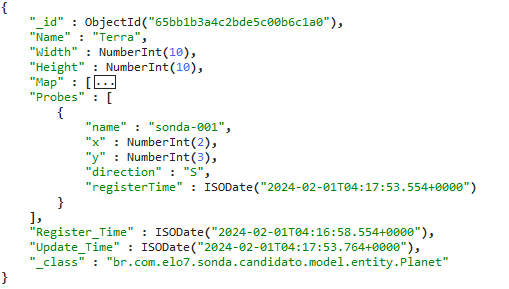

# Comentários Gerais

Esse documento está divido em duas partes. A primeira corresponde a comentários a respeito da solução que se encontrada
nesse repositório. Já a segunda parte, corresponde ao desafio proposto.

## Parte 1 - Seven Mars Service

**Seven Mars Service** é uma API REST que disponibiliza recursos para gestão de **Planetas** e **Sondas** associadas a algum planeta.

O serviço permite a execução de rotinas na base de dados de planetas. Ao todo, são disponibilizados nove operações, seguimentadas em **Planeta** 
(quatro operações) e **Sonda** (cinco operações).

1. **Planeta**
   1. **Cadastrar** um novo planeta;
   2. **Redimensionar** a área mapeada do planeta;
   3. **Obter** as informações de um planeta cadastrado;
   4. **Listar** todos os planetas cadastrados na base de dados.
2. **Sonda**
   1. **Aterrissar** uma nova sonda em algum planeta;
   2. **Mover** a sonda na área mapeada do planeta;
   3. **Obter** as informações de a sonda no planeta;
   4. **Listar** todas as sondas do planeta;
   5. **Partir** a sonda do planeta. 

## Premissas do serivço

1. Planetas e Sondas são identificadas por um nome, de maneira que não poderá existir dois
planetas com um mesmo nome, nem duas sondas, em um mesmo planeta, com o mesmo nome;
2. Só existe sondas associadas a algum planeta, ou seja, toda operação em uma sonda, ocorrerá
mediante apresentação do nome do planeta que possui a sonda;
3. A área mapeada de um planeta começa em X e Y iguais a zero;
4. Um planeta é possível redimensionar área, desde que nenhuma sonda esteja localizada 
além da nova área delimitada;
5. Não é permitido que duas sondas ocupem o mesmo espaço, ou seja, não poderá ocorrer a
aterrissagem de duas sondas no mesmo ponto, ou, o movimento de uma sonda não poderá colidir
com outra que já esteja ocupando aquele espaço;
6. Caso ocorra uma falha (erro) durante a execução de uma cadeia de movimento, todo o 
movimento será desfeito;
7. Caso uma sonda seja removida do planeta, essa sonda deixará de existir, ficando seu nome
disponível para um novo cadastro.

## Recursos disponibilizados

#### Planeta
- Listar todos os planetas cadastrados na base de dados. (`GET /planet`)


    Campos retornados:
        1. Nome (texto);
        2. Largura (numérico inteiro);
        3. Altura (numérico inteiro);
        4. Lista de Sondas (tipo Sonda);
        5. Data de Registro (data e hora);
        6. Data de Atualização (data e hora);


- Obter um planeta a partir de seu nome. (`GET /planet/{name}`)


    Campo de entrada:
        1. Nome (texto - obrigatório);

    Campos retornados:
        1. Nome (texto);
        2. Largura (numérico inteiro);
        3. Altura (numérico inteiro);
        4. Lista de Sondas (tipo Sonda);
        5. Data de Registro (data e hora);
        6. Data de Atualização (data e hora);


- Cadastrar um novo planeta. (`POST /planet`)


    Campos de entrada:
        1. Nome (texto - obrigatório);
        2. Largura (numérico inteiro, maior que zero - obrigatório);
        3. Altura (numérico inteiro, maior que zero - obrigatório);

    Campos retornados:
        1. Nome (texto);
        2. Largura (numérico inteiro);
        3. Altura (numérico inteiro);
        4. Lista de Sondas (tipo Sonda);
        5. Data de Registro (data e hora);

    Validações realizadas:
      1. Nome não deve existir na base de dados;
      2. Nome não pode ser branco;
      3. Largura deve ser maior que zero;
      4. Altura deve ser maior que zero;


- Redimensionar a área mapeada de um planeta cadastrado. (`PUT /planet/{name}`)


    Campos de entrada:
        1. Nome (texto - obrigatório);
        2. Largura (numérico inteiro, maior que zero - obrigatório);
        3. Altura (numérico inteiro, maior que zero - obrigatório);

    Campos retornados:
        1. Nome (texto);
        2. Largura (numérico inteiro);
        3. Altura (numérico inteiro);
        4. Lista de Sondas (tipo Sonda);
        5. Data de Registro (data e hora);
        6. Data de Atualização (data e hora);

    Validações realizadas:
      1. O planeta já deve existir na base de dados;
      2. Nome não pode ser branco;
      3. Largura deve ser maior que zero;
      4. Altura deve ser maior que zero;
      5. Caso o planeta alguma sonda, essas não podem ficar fora da nova área mapeada;

#### Sonda
- Listar todas as sondas contidas em um planeta cadastrado. (`GET /planet/{planetName}/probe`)

 
    Campo de entrada:
        1. Nome do Planeta (texto - obrigatório);

    Campos retornados:
        1. Nome (texto);
        2. X (numérico inteiro);
        3. Y (numérico inteiro);
        4. Direção (texto);
        5. Data de Registro (data e hora);
        6. Data de Atualização (data e hora);

    Validações realizadas:
        1. O planeta deve estar cadastrado;


- Obter uma sonda a partir do seu nome e do nome do planeta em que ela se encontra. 
(`GET /planet/{planetName}/probe/{probeName}`)


    Campo de entrada:
        1. Nome do Planeta (texto - obrigatório);
        2. Nome da Sonda (texto - obrigatório);

    Campos retornados:
        1. Nome (texto);
        2. X (numérico inteiro);
        3. Y (numérico inteiro);
        4. Direção (texto);
        5. Data de Registro (data e hora);
        6. Data de Atualização (data e hora);

    Validações realizadas:
        1. O planeta deve estar cadastrado;
        2. A sonda deve estar associada ao planeta;


- Aterrissar uma nova sonda no planeta. (`POST /planet/{planetName}/probe`)


    Campos de entrada:
        1. Nome (texto - obrigatório);
        2. X (numérico inteiro, maior ou igual zero - obrigatório);
        3. Y (numérico inteiro, maior ou igual zero - obrigatório);
        4. Direção (texto - obrigatório);

    Campos retornados:
        1. Nome (texto);
        2. X (numérico inteiro);
        3. Y (numérico inteiro);
        4. Direção (texto);
        5. Data de Registro (data e hora);

    Validações realizadas:
        1. O planeta deve estar cadastrado;
        2. Nenhuma sonda daquele planeta deve possuir mesmo nome;
        3. A Direção deve possuir um valor entre N, E, S, W (pontos cardiais);
        4. X e Y deve ser uma coordenada válida no planeta, ou seja, 0 <= X < Largura e 0 <= Y < Altura;
        5. Não deve existir nenhuma sonda na X e Y informada;


- Mover uma sonda cadastrada em algum planeta. 
(`POST /planet/{planetName}/probe/{probeName}/move`)


    Campo de entrada:
        1. Nome do Planeta (texto - obrigatório);
        2. Nome da Sonda (texto - obrigatório);
        2. Comandos (texto - obrigatório);

    Campos retornados:
        1. Nome (texto);
        2. X (numérico inteiro);
        3. Y (numérico inteiro);
        4. Direção (texto);
        5. Data de Registro (data e hora);
        6. Data de Atualização (data e hora);

    Validações realizadas:
      1. O planeta já deve existir na base de dados;
      2. A sonda deve estar associada ao planeta;
      3. Os comandos devem ser letra dentre as opções L M R;
      4. O movimento da sonda não pode ultrapassar a área mapeada, nem colidir com alguma sonda já posicionada;

- Remover uma sonda do planeta.
  (`POST /planet/{planetName}/probe/{probeName}/departure`)


    Campo de entrada:
        1. Nome do Planeta (texto - obrigatório);
        2. Nome da Sonda (texto - obrigatório);

    Validações realizadas:
      1. O planeta já deve existir na base de dados;
      2. A sonda deve estar associada ao planeta;

## Limitações
- Não foram implementadas rotinas de segurança de acesso a API (autenticação e autorização), por exemplo, [OAuth2 Security](https://oauth.net/2/). Desta forma, toda
  requisição recebida é processada, mediante as validações descritas no item anterior;
- Não há integração entre o serviço e nenhuma ferramenta de indexação de logs, por exemplo, [Kibana](https://www.elastic.co/pt/kibana);
- Não há integração entre o serviço e nenhuma ferramenta de APM (Application Performance Management);
- Não foi utilizado nenhuma ferramenta de análise estática do código, somente o Jacoco para verificar a cobertura dos testes;
- Não foi utilizado nenhum cofre de senhas ([Vault](https://www.vaultproject.io/)) para ocultar informações de credenciais de acessos expostas no
  código-fonte da aplicação;

## Linguagem, framework e versões

Para realizar o desenvolvimento inicial do serviço, foi utilizado Java, em sua versão 17, com [Spring Boot](https://spring.io/projects/spring-boot) em sua versão 2.6.4.

## Recursos utilizados:

A seguir são listados os principais recursos utilizados para o desenvolvimento do Customer Service:
1. [Lombok](https://projectlombok.org/) - biblioteca Java que cria automaticamente alguns recursos para manipular objetos;
2. [MongoDB](https://www.mongodb.com/pt-br) - banco de dados não relacional do tipo documento, que persiste os dados processados pelo serviço;
3. [H2](https://www.h2database.com/html/main.html) - sistema de gerenciamento de banco de dados relacional escrito em Java;
4. [MapStruct](https://mapstruct.org/) - gerador de código que simplifica a implementação de mapeamentos entre classes DTOs (Data Transfer Object) e classes Entidades;
5. [JUnit 5](https://junit.org/junit5/) - framework utilizado para realizar testes unitários e integrados;
6. [Mockito](https://site.mockito.org/) - estrutura de teste que permite a criação de objetos duplos de teste em testes de unidade automatizados;
7. [REST Assured](https://rest-assured.io/) - biblioteca que permite testar serviços REST, de maneira simplificada, em Java;
8. [JaCoCo](https://www.eclemma.org/jacoco/) - biblioteca de cobertura de códigos;
9. [Swagger](https://swagger.io/) - _framework_ composto por diversas ferramentas que auxilia a descrição, consumo e visualização de serviços de uma API REST;

## Banco de Dados

A seguir é apresentado o modelo do documento (JSON) persistido no banco de dados do serviço (Seven Mars Service).
Por se tratar de um serviço simples, atualmente ele conta apenas com a coleção `Planet`, responsável
por armazenar o registro de todos os planetas.



    Atributos:
      _id: Object Id, chave primário do documento;
      Name: String, não nulo;
      Width: Inteiro, não nulo;
      Height: Inteiro, não nulo;
      Map: Vetor Bidimensional de inteiro, não nulo;
      Probes: Lista de sondas;
          name: String, não nulo;
          x: Inteiro, não nulo;
          y: Inteiro, não nulo;
          direction: String, não nulo;
          registerTime: ISO Date, não nulo;
          updateTime: ISO Date, nulo;
      Register_Time: ISO Date, não nulo;
      Update_Time: ISO Date, nulo;
      _class: String, não nulo;


## Testes

Foram realizados dois tipos de testes automatizados: unitário e integração.

### Unitário e Integração

Foram desenvolvidos **97** testes, sendo eles **54 testes unitários** e **43 testes de integração**.
Ao todo, foram cobertos **90%** das linhas de código do serviço.

Execução dos Testes:

- Testes Unitários e Integrados: `.\mvnw test`
- Relatório Jacoco: {dir_project}/target/site/jacoco/index.html


## Registro de Log

Foram inseridos registros (_logs_) de informações e erros. Os logs de informações contém os valores de parametros, para facilitar
eventuais análises e rastreabilidades.

Já as situações de erros do serviço são capturados, tratados e retornados aos
usuários através de mensagens amigáveis.

Os principais erros do sistema retornam status de resposta HTTP 400 (_Bad Request_) e HTTP 404 (_Not Found_), porém podem existir algumas
situações não mapeadas, onde servidor retornará status de resposta HTTP 500 (_Internal Server Error_).

## Documentação do código

O serviço utiliza a ferramenta [Swagger](https://swagger.io/) para descrever as APIs disponíveis (`/swagger-ui/index.html`).

## Build

O serviço foi desenvolvido utilizando o [Maven 3.9.6](https://maven.apache.org/).

Para construir o projeto o usuário deverá possuir o Maven instalado no seu computador.

No terminal do sistema operacional, vá até à pasta raiz do projeto e execute o comando:

`mvn wrapper`

Após finalizar a execução anterior execute:

`.\mvnw clean install`


## Run

Foi disponibilizado um arquivo _Dockerfile_ para criar a imagem do serviço (SevenMarsService).
Além desse arquivo, também foi disponibilizado o arquivo _docker-compose.yml_ com as configurações necessárias
para iniciar o serviço localmente.

O arquivo _docker-compose.yml_ possui comando que irá inicializar todos os recursos necessários para o correto
funcionamento do SevenMarsService. Desta maneira, caso o _docker-compose.yml_ não seja alterado, é necessário garantir
que as portas `27017 e 8080` não estão sendo utilizadas por outros processos.

Antes de executar o comando Docker é necessário construir (build) o projeto (SevenMarsService).
No momento da execução do _docker-compose.yml_ o _Dockerfile_ também será executado, para tanto é necessário
possuir o [docker-compose](https://docs.docker.com/compose/) instalado e configurado na sua máquina.

Comando para iniciar o docker-compose: `docker-compose up -d`

Caso deseje executar o código local, sem auxílio da imagem docker, é necessário possuir o serviço
**MongoDB** executando. Após isso, no diretório do serviço (SevenMarsService) execute
o comando:

`.\mvnw spring-boot:run`

## Autor e Contato

- Autor: Vanderson Sampaio
- Email: vandersons.sampaio@gmail.com
- Github: https://github.com/vandersonsampaio
- Linkedin: https://www.linkedin.com/in/vanderson-sampaio-399973158/

## Parte 2 - Bem vindo candidato(a)!

Vamos explicar como funciona o nosso desafio:

Um desenvolvedor recebeu um tarefa de uma pessoa da equipe de produto. A pessoa de produto queria poder controlar sondas em outros planetas por meio de comandos. Para explicar o funcionamento do produto, o seguinte exemplo foi escrito em um pedaço de papel:

### Explicação da necessidade:
```
Tamanho da área do planeta : 5x5

Posição de pouso da sonda 1: x=1, y=2 apontando para Norte
Sequencia de comandos: LMLMLMLMM
Posição final da sonda: x=1 y=3 apontando para Norte

Posição de pouso da sonda 2: x=3, y=3 apontando para Leste
Sequencia de comandos: MMRMMRMRRML
Posição final da sonda: x=5 y=1 apontando para Norte
```

### Detalhes sobre o funcionamento acima:

A sequência de comandos é um conjunto de instruções enviadas da terra para a sonda, onde :
- `M` -> Andar para a frente na direção que está 1 posição.
- `L` -> Virar a sonda para a esquerda (90 graus)
- `R` -> Virar a sonda para a direita (90 graus)

A área do planeta é um plano cartesiano com o tamanho informado pelo operador.

A orientação da sonda dentro do plano cartesiano usa uma rosa dos ventos como referência


## O desafio

### Regra de negócios:

- [ ] Primeiramente, **antes de olhar o código** pense quais comportamentos fazem sentido para dar suporte *a várias sondas pousando em um mesmo planeta com uma superfície limitada (podendo haver vários planetas)*. Considere que as sondas possuem combustível infinito e sempre estão disponíveis para receber ordens de movimento.

Essa aplicação foi implementada por um desenvolvedor não muito experiente. O código está funcional e com certa cobertura de testes automatizados mas não necessariamente está seguindo boas práticas. Verifique a implementação sugerida nesse repositório e verifique se:

- [ ] o código da aplicação dá suporte aos comportamentos pensados no primeiro item
- [ ] a API da aplicação dá suporte aos comportamentos pensados no primeiro item

### Crie a sua melhoria sobre a solução proposta aqui:

- [ ] Crie um repositório e faça o push dessa solução para seu novo repo
- [ ] De preferência usando pequenos commits procure corrigir os problemas levantados acima. Para fins de código e divisão de responsabilidades em códigos Orientados a Objeto seguem dois links que exprimem alguns guidelines do Elo7: 

- https://www.alura.com.br/artigos/nao-aprender-oo-getters-e-setters
- https://www.alura.com.br/artigos/o-que-e-modelo-anemico-e-por-que-fugir-dele

Obs: fique à vontade para alterar todas as classes, pacotes etc. **Aproveite apenas o que achar que faz sentido!**

### Para pretensões senior APENAS:

No caso da pretenção estar no patamar de senior nós requisitamos alguns desafios extras:

- [ ] O teste possui um mecanismo de persistência em memória, altere para uma persistência utilizando um ou mais banco de dados de forma a armazenar as informações de planetas e sondas e buscá-las ou alterá-las de maneira eficiente;
- [ ] Se preocupe com uma maneira de documentar a api do sistema web;
- [ ] Tenha em mente escalabilidade, disponibilidade e performance em sua solução. Apesar do problema proposto ser bem didático procure tratar a solução como um sistema de produção real.

Obs: Se você está em dúvida se a sua pretenção é senior ou não procure nossa tech recruiter sobre o assunto, ela saberá responder. Caso sua pretenção seja junior ou pleno você pode encarar os pontos acima como opcionais para demonstrar seu conhecimento e potencializar o valor inicial de nossa oferta, mas se a sua pretenção é junior ou pleno os pontos acima NÃO SÃO OBRIGATÓRIOS para a entrega da solução.

## Informações sobre o projeto

### Como subir o projeto

- Certifique-se que a porta 8080 esteja desocupada;
- Certifique-se de que você possui o maven instalado localmente;
- Certifique-se de que você está na raiz do projeto;
- Rode o `./mvnw spring-boot:run`

Com isso as dependências serão baixadas e a API subirá na porta `8080`;

### Fazendo uma requisição

- Aqui você pode usar o Postman, por exemplo, ou o curl como abaixo:

```bash
curl -X POST http://localhost:8080/planet-with-probes -H 'Content-Type: application/json' -d '{"width":10,"height":10,"probes":[{"x":1,"y":2,"direction":"N","commands": "LMLMLMLMM"},{"x":3,"y":3,"direction":"E","commands": "MMRMMRMRRM"}]}'
```

